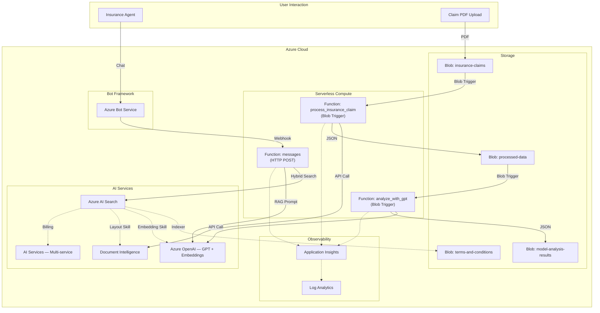
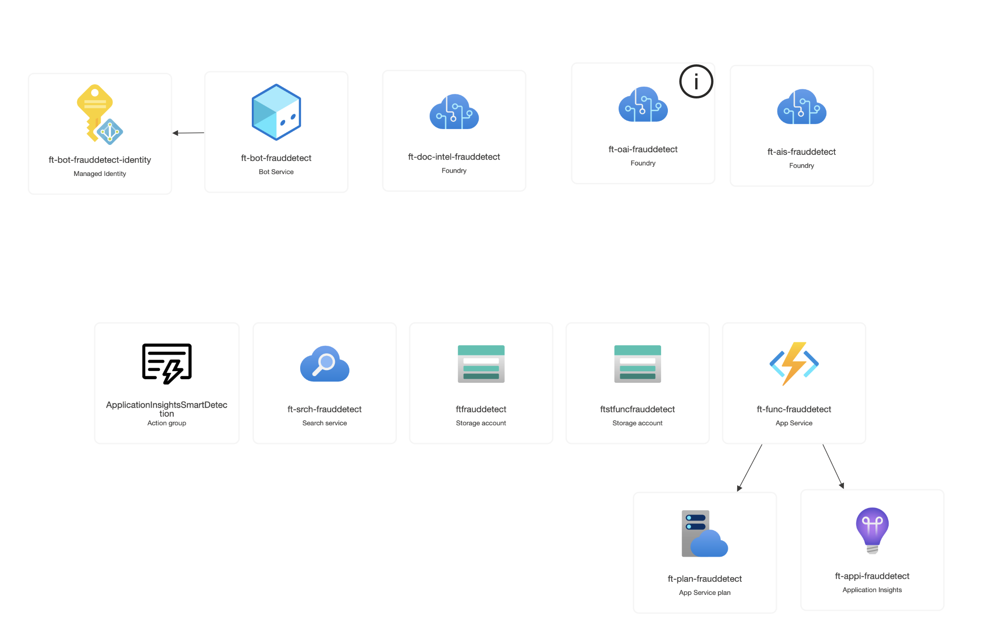
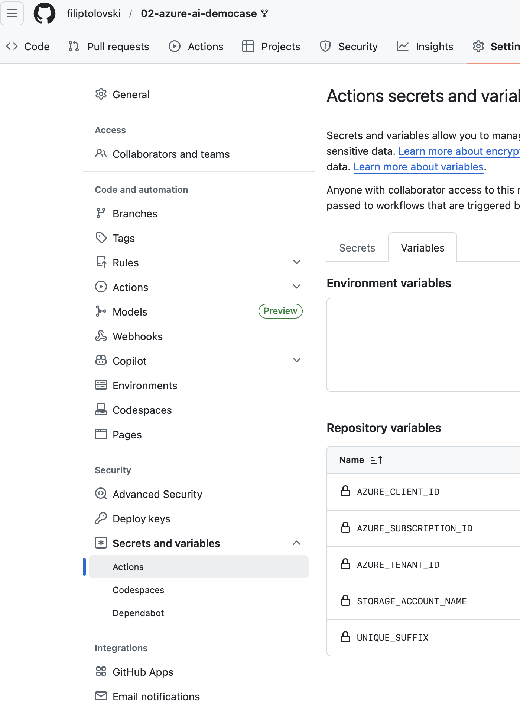
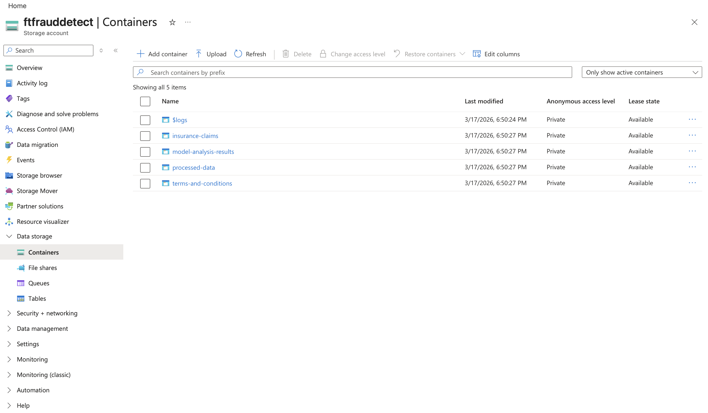
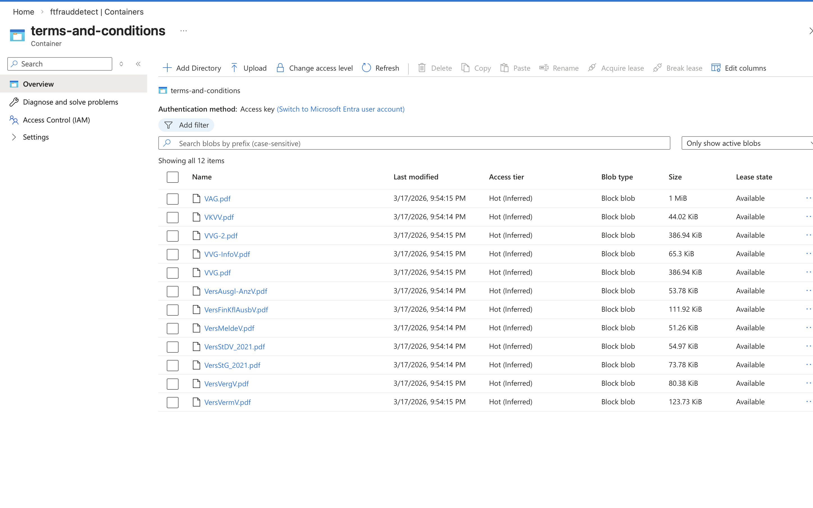
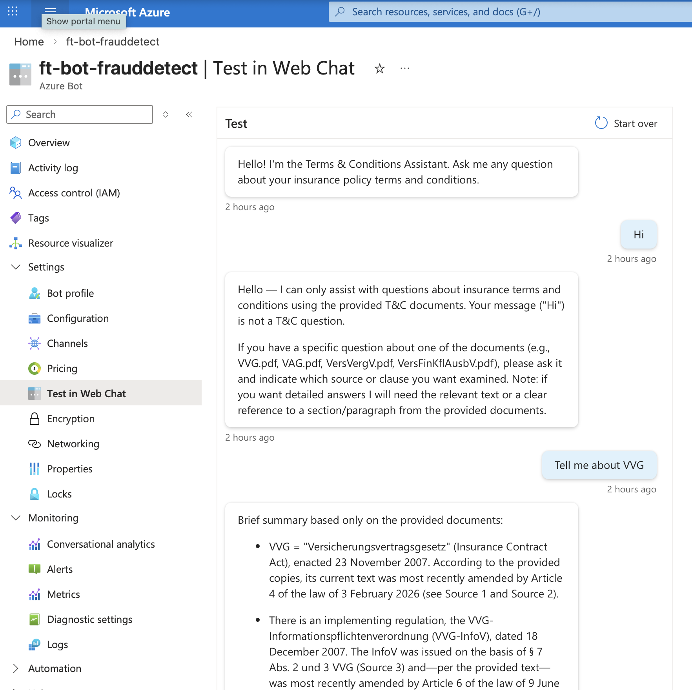
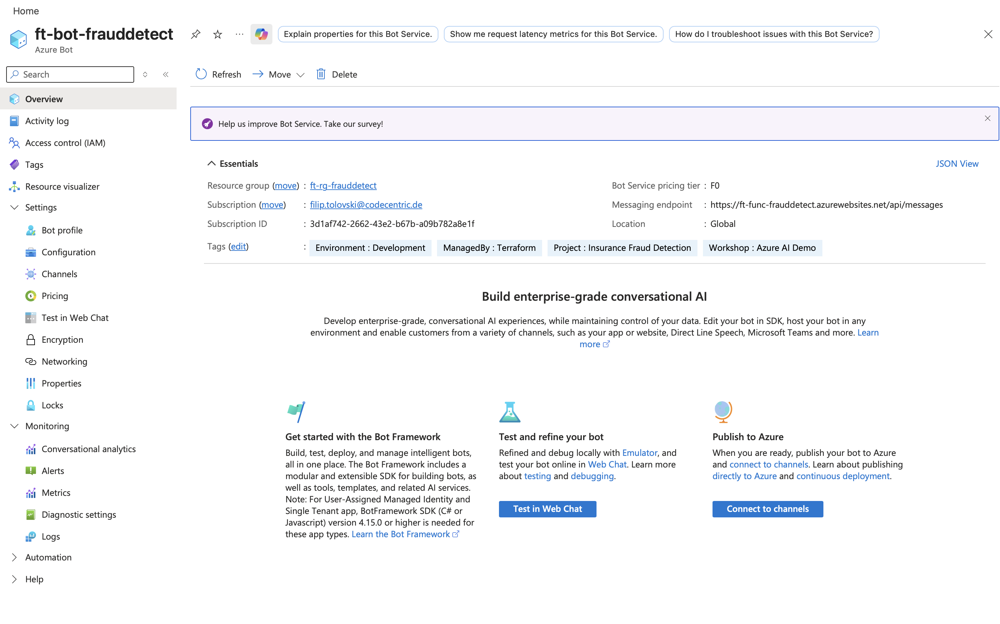
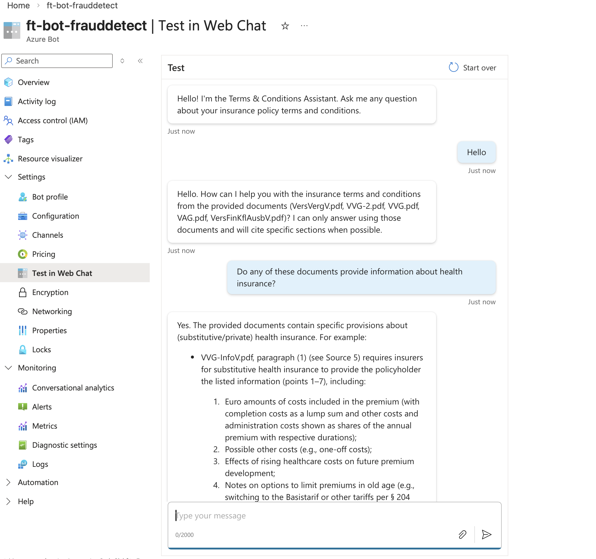
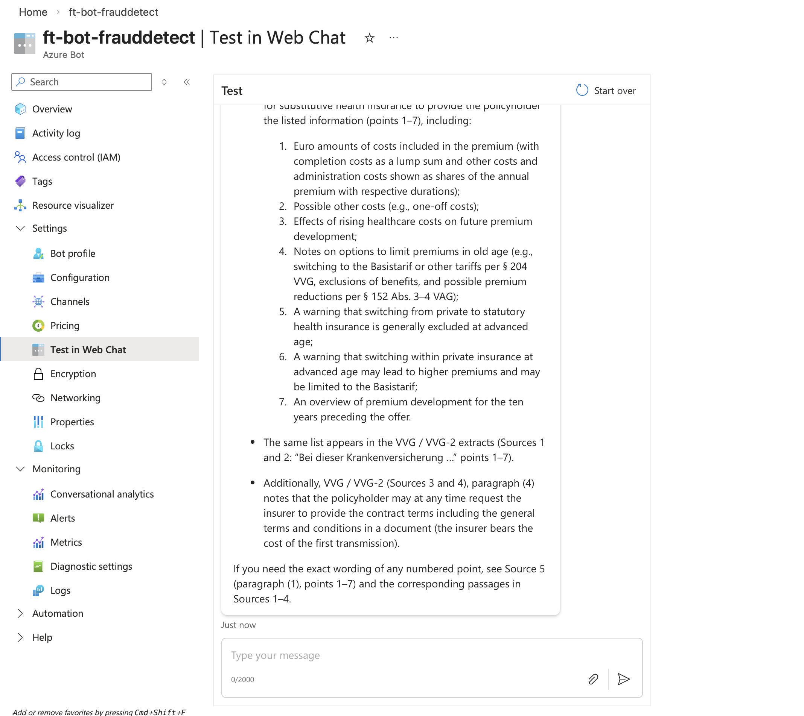

# Azure AI Services demonstration

## Which Azure services we want to demonstrate
- Form/Text Recognition with Document Intelligence
- Storage account triggers
- Azure functions (Python)
- Running Large-Language models on Azure Foundry
- Use Azure Functions as tools for an LLM
- Azure AI Search
- Azure AI Bot Service
- (Bonus) Fraud detection with embeddings models and outlier analysis

## What we will build
We will build an AI insure claim pre-classifier to assist human decision. It analyzes incoming insure claims and pre-sorts them, either for:

- accept right away
- flag for manual review
- reject right away

To increase result quality, the classifier:
- pre-fetches the insurance terms of the given contract (we currently assume there is only one contract type)

Furthermore, we will add a chatbot, which:
- Allows insurance agents to query insurance terms and conditions
- Tell insurance agents how many claims are yet to be reviewed


## Architecture





---

## CI/CD Workflows

### Pull Request > Plan / Validate

When you create a PR that modifies infrastructure or application code:
1. **Terraform** workflow runs `terraform fmt -check`, `validate`, and `plan` — plan output is posted as a PR comment (updates existing comment on subsequent pushes)
2. **CI Build** workflow validates Python syntax via `py_compile`
3. Review results before merging

### Merge to Main > Apply / Deploy

When a PR is merged to `main`:
1. **Terraform** workflow runs `terraform apply`, then automatically executes the search index setup script (`search-setup/setup_search_index.py`) to create/update the index, skillset, and indexer
2. **App Deploy** workflow deploys the Function App via `func azure functionapp publish` with retry logic (up to 3 attempts, 30s delay between retries)

### Workflow Summary

| Workflow               | File                      | Trigger                                        | Action                                       |
| ---------------------- | ------------------------- | ---------------------------------------------- | -------------------------------------------- |
| **Terraform**          | `terraform.yml`           | PR to main (`terraform/**`)                    | `terraform plan`, posts PR comment           |
| **Terraform**          | `terraform.yml`           | Push to main (`terraform/**`)                  | `terraform apply` + search index setup       |
| **Terraform**          | `terraform.yml`           | Manual (`workflow_dispatch`)                   | Plan or apply (selectable)                   |
| **Terraform Destroy**  | `terraform-destroy.yml`   | Manual only                                    | `terraform destroy` (requires `DESTROY` confirmation) |
| **CI Build**           | `app-build.yml`           | PR to main (`function-app/**`)                 | Python syntax validation                     |
| **App Deploy**         | `app-deploy.yml`          | Push to main (`function-app/**`)               | Deploys Function App to Azure                |
| **App Deploy**         | `app-deploy.yml`          | Manual (`workflow_dispatch`)                   | Deploys Function App to Azure                |

### Path-Based Triggers

| Changed Path                        | Triggered Workflows           |
| ----------------------------------- | ----------------------------- |
| `terraform/**`                      | Terraform (plan or apply)     |
| `function-app/**`                   | CI Build (PR) / App Deploy    |
| `.github/workflows/terraform*.yml`  | Terraform (plan or apply)     |
| `.github/workflows/app-*.yml`       | CI Build / App Deploy         |

### Concurrency

Both the Terraform and App Deploy workflows use concurrency groups to prevent parallel runs:
- `ai-democase-terraform-${{ github.ref }}`
- `ai-democase-app-${{ github.ref }}`

`cancel-in-progress` is set to `false` — new runs queue instead of cancelling in-flight runs.

---

## Cost Optimization

This is configured for **workshop/dev-test** workloads. Lower tiers are used where possible.

| Resource               | Tier / SKU           | Reasoning                                                            |
| ---------------------- | -------------------- | -------------------------------------------------------------------- |
| Azure Functions        | Consumption (Y1)     | Pay-per-execution, ideal for sporadic claim processing               |
| Blob Storage           | Standard LRS         | Locally redundant; sufficient for workshop data                      |
| Document Intelligence  | S0                   | Standard tier; supports `prebuilt-document` model                    |
| Azure OpenAI           | S0                   | Standard tier; capacity set to 10K TPM per deployment                |
| Azure AI Search        | Basic                | Supports semantic search; upgrade to Standard for production volumes |
| AI Services            | S0                   | Multi-service billing account for Search skillset                    |
| Bot Service            | F0 (Free)            | Free tier; sufficient for workshop chat volumes                      |
| App Insights           | PerGB2018 (30d)      | Default pricing; 30-day retention                                    |

---

## Deployment

### Prerequisites

| Tool        | Version  | Install                                      |
| ----------- | -------- | -------------------------------------------- |
| Azure CLI   | 2.50+    | `brew install azure-cli`                     |
| Terraform   | 1.14.x   | `brew install tfenv && tfenv install 1.14.4` |
| Python      | 3.11+    | `brew install python@3.11`                   |
| Func Tools  | 4.x      | `npm install -g azure-functions-core-tools@4` |

```bash
az login && az account show
terraform version
python3 --version
```

**Required access:** Azure subscription with Owner (or Contributor + User Access Administrator). GitHub repository admin access.

### Bootstrap

Creates state storage, a managed identity for GitHub Actions with federated OIDC credentials, and **automatically configures GitHub Actions variables**.

#### Initialize `terraform.tfvars`

Some Azure resource names must be globally unique. Set a unique suffix (1-4 characters, e.g. your initials) in `unique_variable_name_suffix`.

**`bootstrap/terraform.tfvars`** — set your `subscription_id`, `github_org`, `github_repo`, and `unique_variable_name_suffix`:

```hcl
subscription_id             = "<your-subscription-id>"
location                    = "germanywestcentral"
project_name                = "ccworkshop"
github_org                  = "<your-github-org>"
github_repo                 = "02-azure-ai-democase"
unique_variable_name_suffix = "<your-initials>"  # e.g. "mm" for Max Mustermann
```

#### GitHub Personal Access Token

The bootstrap Terraform automatically creates GitHub Actions variables. To enable this, you need a GitHub PAT.

1. Create a PAT at https://github.com/settings/personal-access-tokens with the following repository permissions:
   - `Read access to metadata`
   - `Read and Write access to actions variables`
2. Provide the token to Terraform:
   - Set the environment variable: `export GITHUB_TOKEN=<your-token>`
   - Or pass it directly: `terraform apply -var="github_token=<your-token>"`

#### Run Bootstrap

```bash
cd bootstrap

terraform init
terraform plan
terraform apply

# Verify outputs
terraform output github_actions_configuration
```

After a successful apply, verify the GitHub Actions variables at: Repository Settings > Secrets and variables > Actions > Variables.



### Infrastructure Deployment

Ensure `terraform/terraform.tfvars` (or create it) has the same `unique_variable_name_suffix` as the bootstrap:

```hcl
unique_variable_name_suffix = "<your-initials>"  # must match bootstrap
```

#### Deploy via GitHub Actions (recommended):

1. Go to Actions > **Terraform** workflow
2. Click **Run workflow** > select `main` > check **apply** > Run
3. The workflow will:
   - Format check, init, validate, plan, and apply the Terraform configuration
   - Automatically run the search index setup script (creates index, skillset, and indexer)


### Function App Deployment

#### Deploy via GitHub Actions (recommended):

Push changes to `function-app/**` on `main` — the **App Deploy** workflow triggers automatically.

### Upload Data

#### Upload terms and conditions (required for chatbot):

Navigate to your Storage Account in the Azure Portal > **Containers** > `terms-and-conditions` and upload your T&C PDF documents.




### Verification

#### Test the claim processing pipeline:

1. Navigate to your Storage Account in the Azure Portal > **Containers** > `insurance-claims`
2. Click **Upload** and select a sample claim PDF from `sample-data/claims/` (e.g. `suspicious-claim.pdf`)
3. After ~30 seconds, check the `processed-data` container — a JSON file with the Document Intelligence extraction results should appear
4. After ~60 seconds, check the `model-analysis-results` container — a JSON file with the GPT fraud risk assessment should appear
5. Click on the result blob > **Edit** to view the analysis inline

#### Test the RAG chatbot:

Open the Bot Service in the Azure Portal > **Test in Web Chat** and ask a question about terms and conditions (e.g. "What is the deductible for collision damage?").







### Cleanup / Destroy

**Via GitHub Actions:** Actions > **Terraform Destroy** > type `DESTROY` to confirm > Run.

